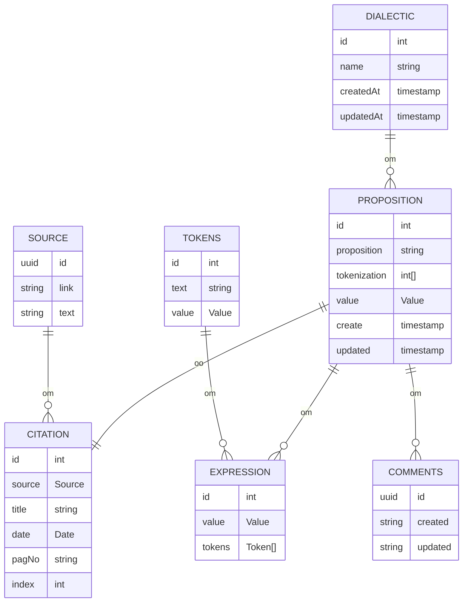

Propositional Analysis ERD

```mermaid
erDiagram
	TOKENS {
		id int
		text string
		value Value
	}
	
	EXPRESSION {
		id int
		value Value
		tokens Token[]
	}
	
	DIALECTIC {
		id int
		name string
		createdAt timestamp
		updatedAt timestamp
	}
	
	PROPOSITION {
		id int
		proposition string
		tokenization int[]
		value Value
		create timestamp
		updated timestamp
	}
	
	CITATION {
		id int
		source Source
		title string
		date Date
		pagNo string
		index int
	}

    SOURCE {
	    uuid id
	    string link
	    string text
    }
    
	COMMENTS {
        uuid id
        string created
        string updated
    }
    
    SOURCE ||--o{ CITATION : om 
    TOKENS ||--o{ EXPRESSION : om
    PROPOSITION ||--|| CITATION: oo
    PROPOSITION ||--o{ EXPRESSION : om
    DIALECTIC ||--o{ PROPOSITION: om
    PROPOSITION ||--o{ COMMENTS : om
    
```