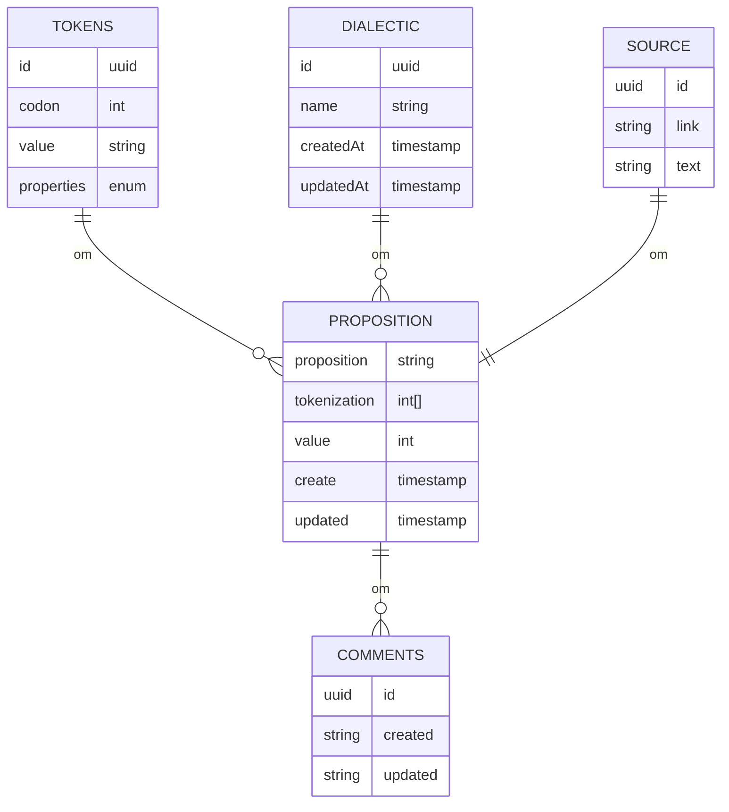

---
creation date:		2023-05-17 16:06
modification date:	2023-05-17 16:06
title: Develop system for realtime data-collection and analysis of propositions from demon processes
tags:
---
# Data Collection
## Schemas
### Token
```ts
{
	id: uuid
	codon: int
	value: string
	tokenization: int[]
}
```

### Source
```ts
{
	id: uuid
	link: string
}
```

### Dialectic
```typescript
{
	id: uuid
	name: string
	createdAt: string
	updatedAt: string
}
```

### Proposition
```ts
{
	proposition: string
	tokenization: int[]
	value: int
	create: Timestamp
	update: Timestamp
}
```

### Comment
```ts
{
	id: uuid
	string: created
	string: updated
}
```




## Wireframe
![[interface.svg]]
* App
	* `/dialectic`
		* DialecticList
			* Dialectic Card
	* `/proposition`
		* PropositionList
			* Proposition Card
		* Text Inputs

# ![[API]]
## Services
![[Services for logical analysis.svg]]

## [[2023-05-23]]
## Tasks
- [x] Set up project ✅ 2023-05-23
- [x] Set up repo ✅ 2023-05-23
- [x] Set up router ✅ 2023-05-23

## [[2023-05-25]]
## Tasks
- [ ] Implement Propositions resource
- [ ] Implement Tokens resource

## [[2023-05-27]]
- [ ] Implement Dialectic Interfaces
	- [x] Implement click handler for items ✅ 2023-05-27
	- [x] Add a button for creating a new dialectic ✅ 2023-05-27
		- [x] Implement element ✅ 2023-05-27
		- [x] Implement click handler ✅ 2023-05-27
	- [x] Implement Backend ✅ 2023-05-31
		- [x] Create Github Repo ✅ 2023-05-27
		- [x] Set Up Nest Project ✅ 2023-05-27
		- [x] Implement Dialectic resource
			- [x] Implement Post Method for dialectic interface ✅ 2023-05-27
			- [x] Set up controller ✅ 2023-05-27
			- [x] Set up service ✅ 2023-05-27
			- [x] [[Research postgres setup for nest]] ✅ 2023-05-28
			- [x] Generate tasks ✅ 2023-05-28
			- [x] Update model and dto for dialectic resource ✅ 2023-05-28
			- [x] Set up Postgres DB ✅ 2023-05-28
			- [x] Set up repository resource ✅ 2023-05-28


	- [x] Implement fetch methods for dialectic interface 📅 2023-05-31 ✅ 2023-05-31

- [ ] Implement Propositions interface
	- [x] Skeleton ✅ 2023-05-27
	- [x] implement onSubmit Handler ✅ 2023-05-31
	- [x] [[Implement Post method for propositions]] 📅 2023-05-31 ✅ 2023-05-31
	- [ ] Implement Tokenization Resource 📅 2023-05-31 
		- [ ] Implement Token Entity
		- [ ] Implement Token Service
			- [ ] Implement method for tokenizing a string
		- [ ] Import tokenization module into propositions module
		- [ ] Import tokenization service into propositions service
	- [ ] Implement fetch methods for propositions interface
## Notes
* We are passing the index but its interpreted as an object instead of an integer
- [x] Log from handler, record observation ✅ 2023-05-27
- If the param is defined in the parent scope, we don't need to pass every param in the encapsulating lambda just the event.
* We need to determine why our post method is failing. 

# [[2023-05-31]]
- [x] Fix post and retrieval of dialectic ✅ 2023-05-31
- [ ] 
- [ ] [[Implement Post method for propositions]] 📅 2023-05-31
- [ ] Implement Tokenization Resource 📅 2023-05-31 
- [ ] Implement fetch methods for dialectic interface 📅 2023-05-31 