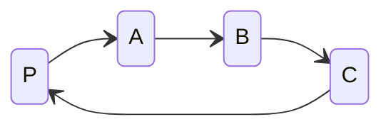
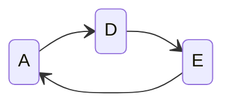
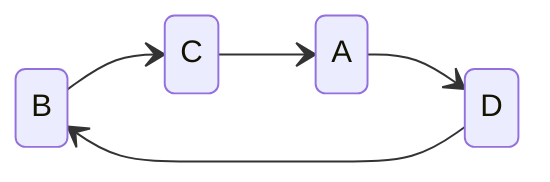
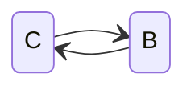
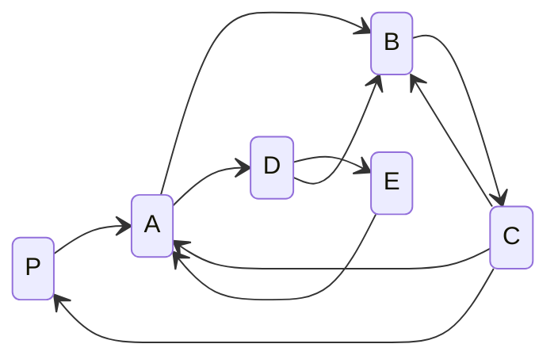

---
creation date:		2023-07-04 16:59
modification date:	2023-07-04 16:59
title: 				Notes related to the implementation of host succession
tags:
---
0. There is at least one observable process P (T)
1. Process P generates evidence to support the existence of other observable processes (T)
	(omit in represative description)
3. Process P represents a list of observable processes, [A, B, C]. Equiv notation: P:[A, B, C]
4. A: [D, E]
5. B: [C, A, D]
6. C: [B]
7. Succession of P's representation

7. Succession of A's representation 

8. Succession of B's representation

9. Succession of C's representation

10. Directed Succession Graph

11. Recursive representation of directed succession graph
 

---
[1^]: : [OBJ-ODS-0.1.1_implement_host succession](OBJ-ODS-0.1.1_implement_host%20succession.md)
[2^]: : [Tasks related them implementation of host succession](Tasks%20related%20them%20implementation%20of%20host%20succession.md)