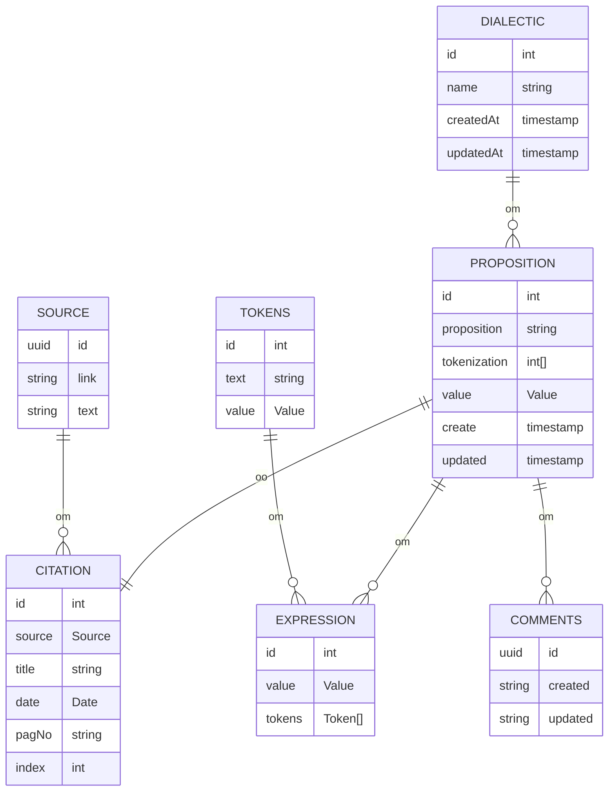

---
creation date:		2023-06-03 21:28
modification date:	2023-06-03 21:30
title: 				Data Model
tags: #tools #engineering
---
## High Level Description
* **Propositions** contains the properties
	* proposition: string representing the proposition in standard form
	* tokenization: an integer array, of tokens representing the proposition
	* created: a Timestamp representing the time the proposition was submitted
	* updated: a Timestamp representing the time the proposition was submitted
* **Comments** contains the following properties
	* text: string
	* created: a Timestamp representing the time the comment was submitted
	* updated: a Timestamp representing the time the comment was updated
* **Source** contains the following properties
	* link: string
	* text: string

## Types
### Value
```ts
type Value = 'T' | 'A' | 'U' | 'R' | 'F' | 'C'

```

### Token
```ts
interface Token {
	id: int
	text: string
	value: Value	
	tokenization: int[]
}
```

### Expression
```ts
interface Expression {
	id: int
	value: Value
	tokens: Token[]
}
```

### Proposition
```ts
interface Proposition {
	id: int
	expressions: Expression[]
	value: Value
	create: Timestamp
	update: Timestamp
}
```

### Source
```ts
interface Source {
	id: int
	link: string
}
```

### Citation
```ts
interface Citation {
	id: int
	source: Source
	title: string
	date: Date
	pagNo: string
	index: int
}
```

### Dialectic
```typescript
interface Dialectic {
	id: int
	name: string
	createdAt: string
	updatedAt: string
}
```

### Comment
```ts
interface Comment {
	id: int
	string: created
	string: updated
}
```


## ERD

